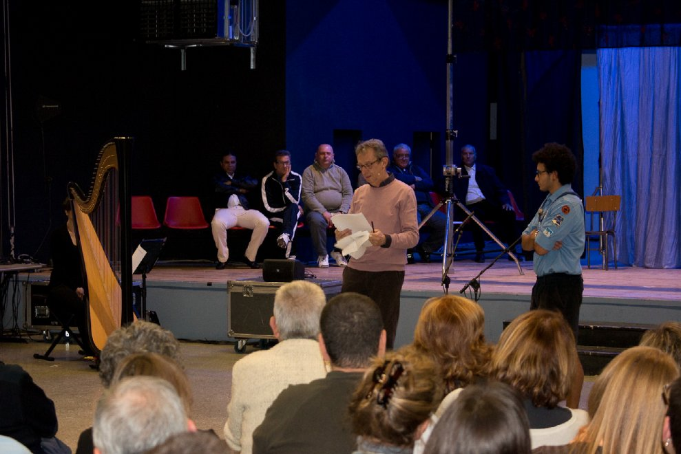

## Spettacolo "Le Finestre"
Il 24 Ottobre 2023 ho avuto il piacere di partecipare come spettatore allo spettacolo "Finestre" all'interno dell carcere Lorusso e Cotugno.
Lo spettacolo parla direttamente allo spettatore della speranza e del buio: avere il nulla come prospettiva dopo l’uscita dal carcere.

Seppure i carcerati non abbiano speranza di trovare una vita migliore al di fuori del carcere, "Le Finestre", racconta proprio di questa virtù.

### Incontro con Elisabetta Baro
Elisabetta Baro fa parte della compagnia teatrale che lavora all'interno del carcere Lorusso e Cotugno.
> "Perché il teatro in carcere?"

Il carcere deve garantire attività per rieducare i detenuti attraverso la rifrlessione sulla propria vita e su sè stessi.
Il teatro è strumento di trasformazione per il detenuto.

Nel carcere, i *concellini*, devono condividere tutto, anche l'intimità.
I detenuti cucinano nella propria cella, nel bagno.
